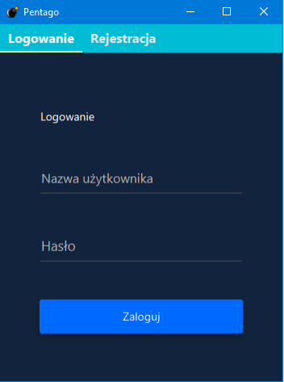
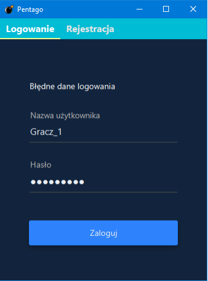
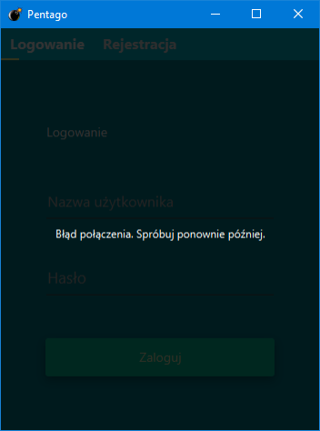
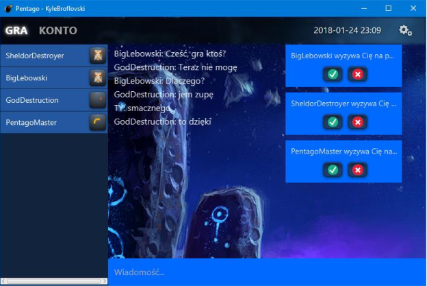
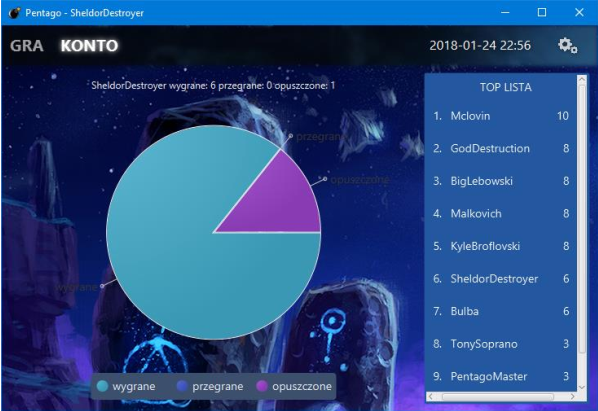
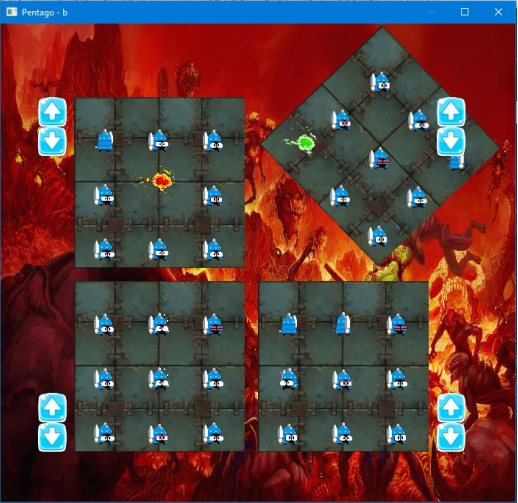
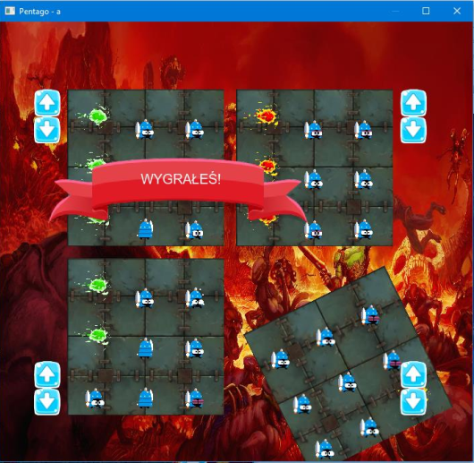

# PentagoJavaFX_programowanie_zdarzeniowe
## Opis projektu
Celem projektu było dostarczenie aplikacji umożliwiającej rozgrywanie meczy w Pentago pomiędzy użytkownikami. Aktywni użytkownicy mogą prowadzić konwersacje tekstowe na globalnym czacie, oraz wysyłać zaproszenia do pojedynków. Po zaakceptowaniu takiego zaproszenia dwóch użytkowników rozgrywa ze sobą mecz. Aplikacja tworzy także ranking użytkowników.

## Zrzuty ekranu

  

  

  

  

  

  

  

